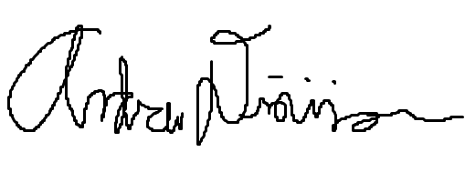

# Contributor Covenant Code of Conduct

## Our Pledge

We as developers of Group 222 pledge to make participation in our
community a harassment-free experience for everyone, regardless of age, body
size, visible or invisible disability, ethnicity, sex characteristics, gender
identity and expression, level of experience, education, socio-economic status,
nationality, personal appearance, race, caste, color, religion, or sexual
identity and orientation.

We pledge to act and interact in ways that contribute to an open, welcoming,
diverse, inclusive, and healthy community.

## Our Standards

Examples of behavior that contributes to a positive environment for our
community include:

* Demonstrating empathy and kindness toward other people
* Being respectful of differing opinions, viewpoints, and experiences
* Giving and gracefully accepting constructive feedback
* Accepting responsibility and apologizing to those affected by our mistakes,
  and learning from the experience
* Focusing on what is best not just for us as individuals, but for the overall
  community

Examples of unacceptable behavior include:

* The use of sexualized language or imagery, and sexual attention or advances of
  any kind
* Trolling, insulting or derogatory comments, and personal or political attacks
* Public or private harassment
* Publishing others' private information, such as a physical or email address,
  without their explicit permission
* Other conduct which could reasonably be considered inappropriate in a
  professional setting

## Enforcement Responsibilities

Community leaders are responsible for clarifying and enforcing our standards of
acceptable behavior and will take appropriate and fair corrective action in
response to any behavior that they deem inappropriate, threatening, offensive,
or harmful.

Community leaders have the right and responsibility to remove, edit, or reject
comments, commits, code, wiki edits, issues, and other contributions that are
not aligned to this Code of Conduct, and will communicate reasons for moderation
decisions when appropriate.

## Scope

This Code of Conduct applies within all group spaces. Including the group discord and meeting times in class

## Enforcement

Instances of abusive, harassing, or otherwise unacceptable behavior may be
reported to the community leaders responsible for enforcement at
[305Soft Group].
All complaints will be reviewed and investigated promptly and fairly.

## Decisions

Decisions will be made by a majority vote through a poll. There are 5 memebers in our group meaning a vote of 3 is majority. 

## Attendance

Attendance is mandatory but effective communication with the group as to why a member can not make a meeting will be accepted. Missing memebers will need to check in with group at next meeting date and/or read the meeting notes.

## Assignments

Assignments will be made by a group decision. If a member does not complete assignment or completes poorly, a warning is issued and after 305Soft will be notified. 

## Participation

Communication and Information will be shared via in-person and over discord. Participation will be ensured by each group memeber getting a set time to talk about anything related to what they are working on in each meeting. The group will encourage everyone to talk and share opinions on every task/issue.

## Meeting Times

Meeting times will be selected class time and one night during the week that the group memebers will agree on. 

## Agenda and Minutes

Brandon Charette will take notes on meetings through short bullet points and place in discord.

## Promptness

Members will be on time for meetings unless effectivley communicated with other group memebers. If a member is late, they will have to read the meeting notes after the meeting is over. 

## Conversational Courtesies

Each member will have a short time to talk about what they have been working on, then group discussion on what is next. If there is a disagreement in the group, each group memeber must remain professional and the disagreement will be handled by group vote. If the disagreement is escalted any further, 305Soft group will be notified. 

## Signitures

The following group members have read and agreed to follow all rules of this document.

## Attribution

This Code of Conduct is adapted from the [Contributor Covenant][homepage],
version 2.1, available at
[https://www.contributor-covenant.org/version/2/1/code_of_conduct.html][v2.1].

Community Impact Guidelines were inspired by
[Mozilla's code of conduct enforcement ladder][Mozilla CoC].

For answers to common questions about this code of conduct, see the FAQ at
[https://www.contributor-covenant.org/faq][FAQ]. Translations are available at
[https://www.contributor-covenant.org/translations][translations].

[homepage]: https://www.contributor-covenant.org
[v2.1]: https://www.contributor-covenant.org/version/2/1/code_of_conduct.html
[Mozilla CoC]: https://github.com/mozilla/diversity
[FAQ]: https://www.contributor-covenant.org/faq
[translations]: https://www.contributor-covenant.org/translations
