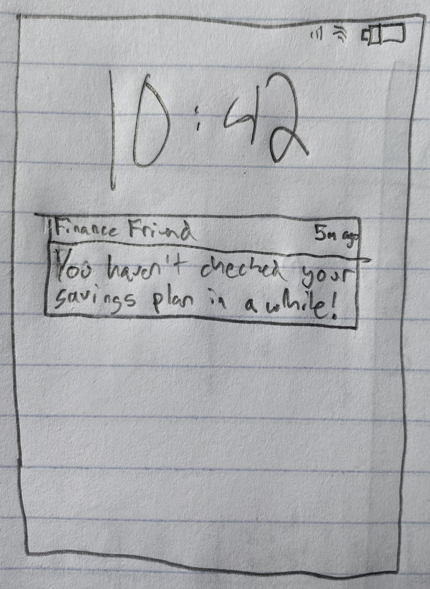

**A/B Test Name**: Users Don't Check Savings Plan Often

**User Story Number**: 8

**Metric**: Engagement

**Hypothesis**: 

Push notifications to remind users to check Savings Plan. If this hypothesis is sucessful, a majority of users
will click on the push notifcation and their time spent on the savings plan page will increase. 

**Experiement**: 

In order to carry out this test, 50% of users would get a push notifcation that is a reminder to check in 
on their savings plan. The tracking that needs to be set up would be to check if users are clicking on the 
notification and also how much time is spent by the group on the savings plan page. 

**Varitations**: 

There wouldn't be any variations to the app layout or design changes. The only different thing that would 
happen is the user gets a notification on their homescreen. 

