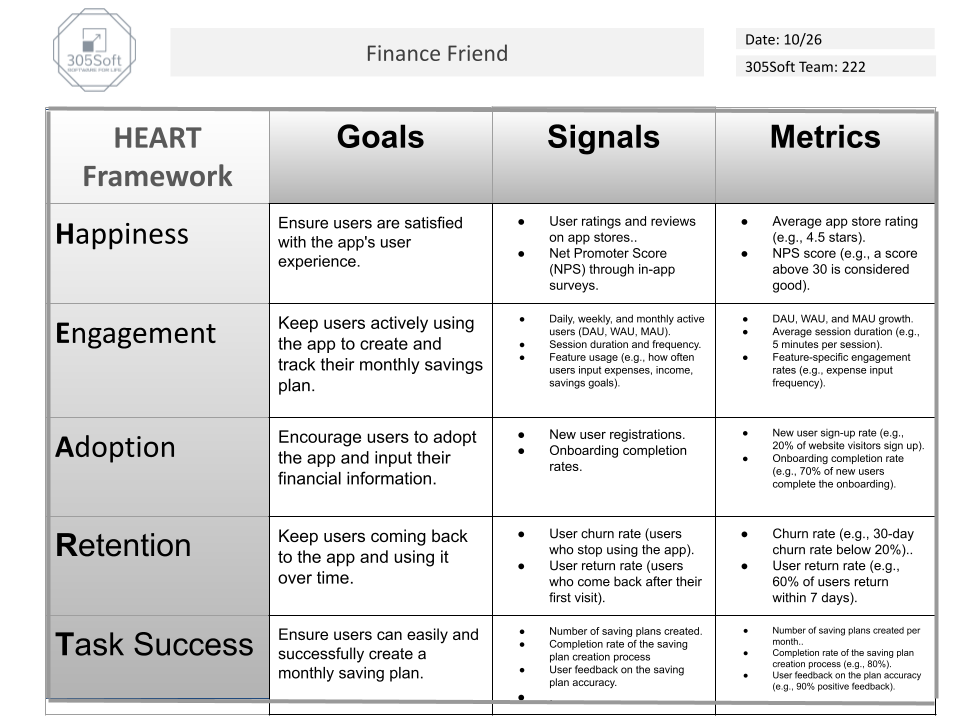

*  Net Promoter Score - We would collect this metric by asking the user, via a pop up, after a certain amount of time if they would recommend using this app to other people. If the user says no, the timer will reset and they will be asked again after a certain amount of time using the app. If the user says yes, it will redirect them to a survey that asks how likey on a scale from 1-5 and after it is submitted, they will never ask again.
* Metric 2 -
* Metric 3 -
* Metric 4 -
* Metric 5 -
